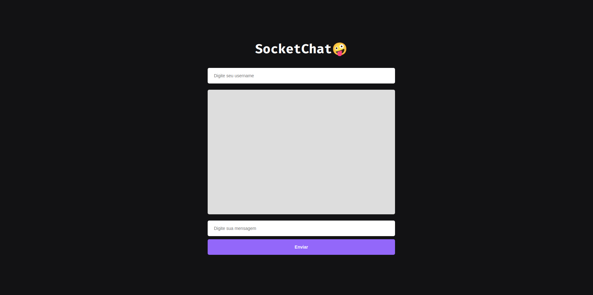

# SocketChat🤪

Um chat para envio de mensagens em tempo real.



## Tecnologias:

O projeto foi desenvolvido utilizando as seguintes ferramentas e tecnologias:

- [Node.js](https://nodejs.org/)
- [Express.js](https://expressjs.com/pt-br/)
- [Socket.io](https://socket.io/)

## Instalação e executar o projeto

Para clonar e executar o projeto basta seguir os seguintes comandos:

```jsx
#Clonar o repositório
$ git clone https://github.com/felpssc/SocketChat.git

#Entrar na raiz do projeto
$ cd SocketChat

#Iniciar projeto
$ yarn start
```